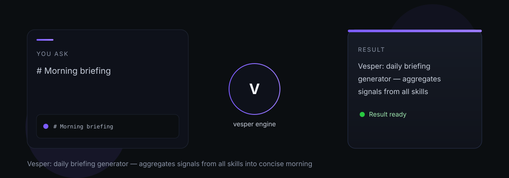

# vesper

vesper — Vesper: daily briefing generator — aggregates signals from all skills into concise morning and evening briefings.

> Tell it what you need. It does the work.

## What it does

Vesper aggregates signals from every other skill and assembles them into morning or evening briefings in natural language. Signal filtering is strict: routine background activity, speculative observations, and already-experienced events are excluded. The result is a briefing that earns attention rather than demanding it. Vesper also presents pending decision requests with option, benefit, and cost framing.

## Dependencies

- [Corvus](https://github.com/indigokarasu/corvus) — receives InsightProposal files
- [Dispatch](https://github.com/indigokarasu/dispatch) — may deliver briefings
- [Rally](https://github.com/indigokarasu/rally) — portfolio outcome signals
- [Sands](https://github.com/indigokarasu/sands) — calendar events
- Calendar and Weather APIs

---

*vesper is part of the [OCAS Agent Suite](https://github.com/indigokarasu).*